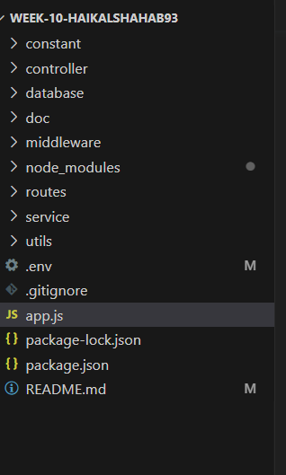

 

<h5 align="center">Created by Using</h5>

    </a> 

<h5 align="center">Link Project</h5>

<a href="https://week-11-haikalshahab93-production.up.railway.app/api-docs/">https://week-11-haikalshahab93-production.up.railway.app/api-docs/</a>

# Project Description

in the 11th week of the project, a restful api was created for registering, logging in, transferring, in the transfer menu the status changes the stock of the product. If the product status is buy, the stock will increase according to the amount given, and if the status is selling, the stock of the product will be reduced  

# Folders Structure

Here, i will try to explain the structure of important folders for this project by using the image below.

 

1. constant , to handle the error function
2. database to store selected database connection based on production or local developer.
3. doc to save document data with the yaml extension
4. middleware This folder serves to store middlewares for this project
5. routes direction routing to destination
6. service processor in the controller
